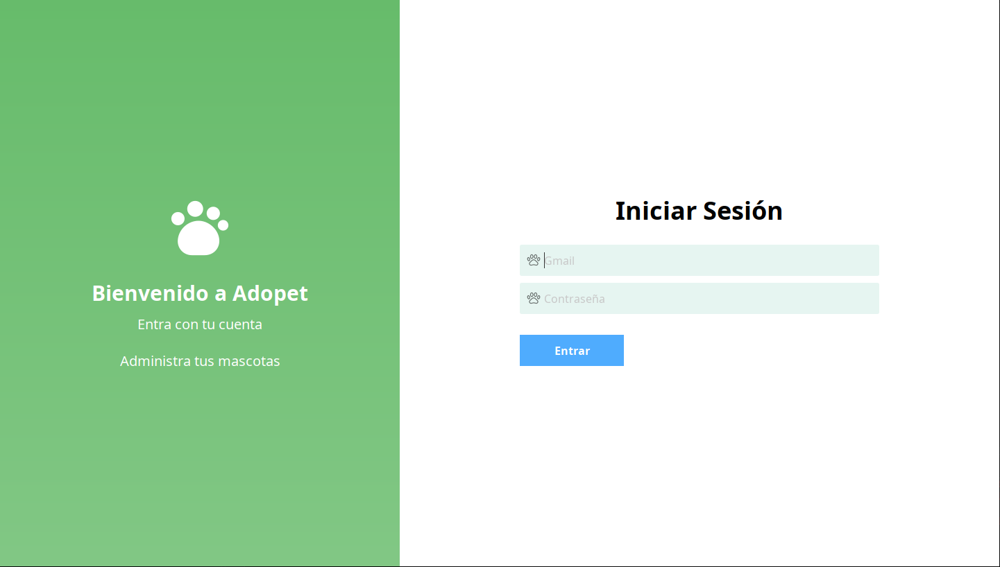
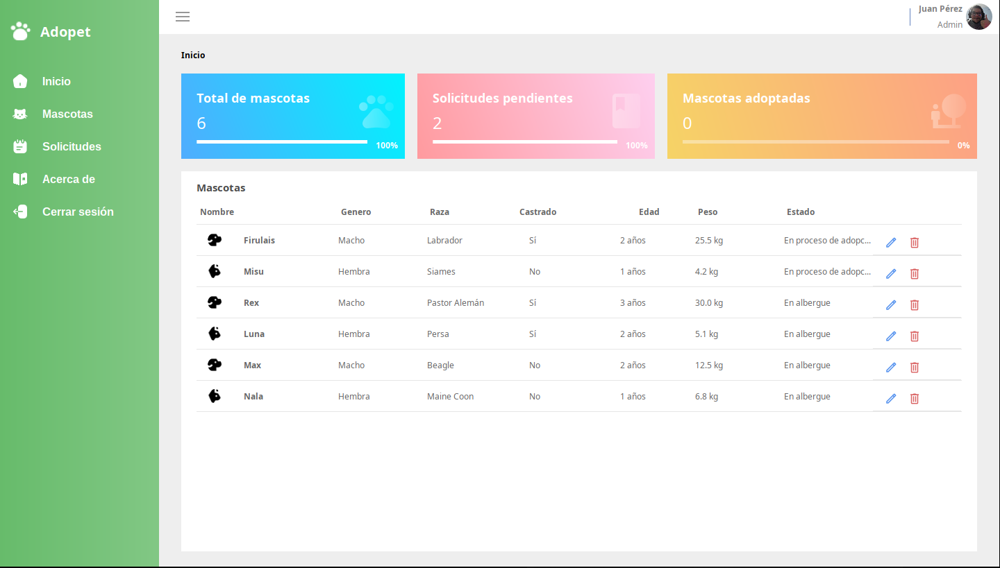
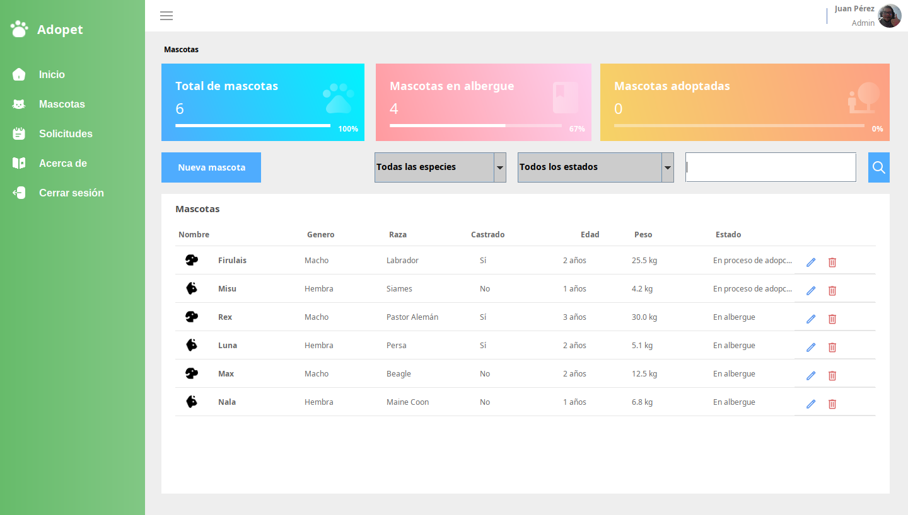
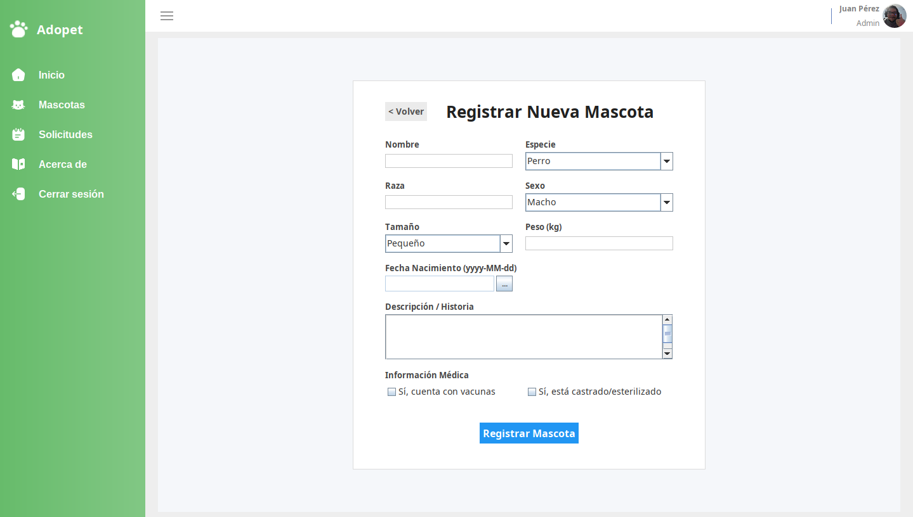
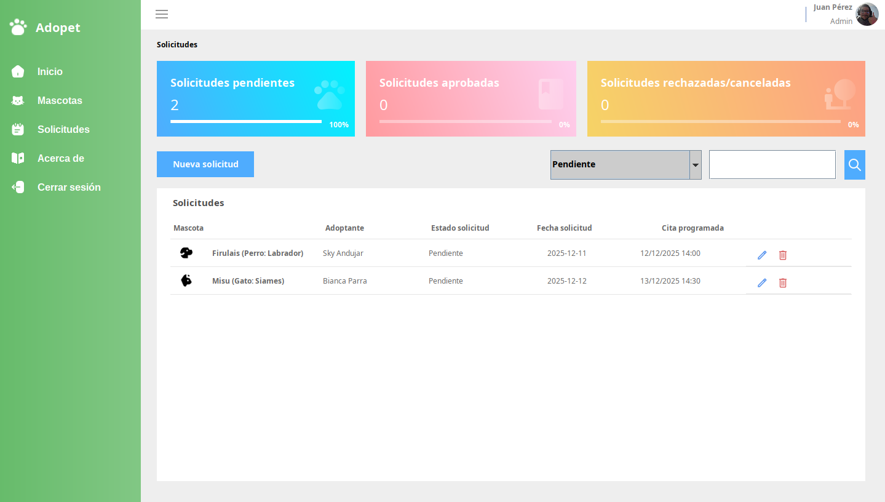
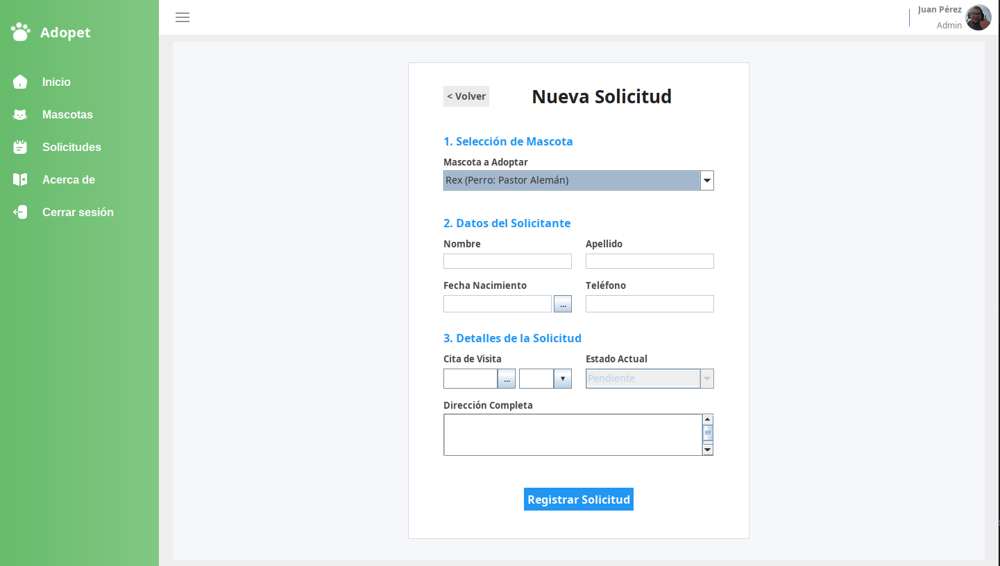

# 🐾 Adopet – Sistema de Gestión de Adopción de Animales

**Adopet** es una aplicación de escritorio desarrollada en **Java Swing**, diseñada para optimizar la gestión integral de refugios de animales.  

El sistema facilita el registro, control y seguimiento de mascotas y adoptantes mediante una interfaz moderna, intuitiva y centrada en la productividad.

🎓 *Proyecto académico desarrollado por el equipo **StackMasters***.

---

## 📋 Características Principales

### 🐶 Gestión de Mascotas
- CRUD completo (crear, editar, listar y eliminar).  
- Fichas detalladas con información de raza, edad, peso y estado de salud.

### 🔍 Búsqueda y Filtrado Avanzado
- Filtros dinámicos por especie (*Perro / Gato*), estado (*En albergue, En proceso de adopción, Adoptado*) y nombre.

### 📝 Gestión de Solicitudes de Adopción
- Flujo completo de aprobación o rechazo de solicitudes, con validaciones automáticas.

### 📅 Agenda de Citas
- Programación de visitas con validación de fechas y horarios para evitar conflictos de agenda.

### 📊 Dashboard Estadístico
- Tarjetas informativas con métricas en tiempo real:  
  total de mascotas, adopciones completadas y nivel de ocupación del albergue.

### 🔐 Seguridad y Control de Acceso
- Inicio de sesión con roles de usuario (Administrador).  
- Encriptación de contraseñas con **BCrypt**.  
- Manejo seguro de sesiones y cierre controlado.

---

## 🧩 Arquitectura del Sistema

El proyecto sigue una **arquitectura en capas (N-Tier)** que favorece la mantenibilidad, modularidad y escalabilidad del sistema.

- **Vista (View):** Interfaz construida con Java Swing y componentes personalizados (botones, tablas y paneles redondeados). Implementa el patrón *Observer* para la navegación entre vistas.  
- **Controlador (Controller):** Gestiona la interacción entre la interfaz y la lógica de negocio. Maneja eventos, validaciones y comunicación entre capas.  
- **Servicio (Service):** Contiene las reglas de negocio del sistema (validaciones de estados, restricciones de fechas, etc.).  
- **Repositorio (Repository / DAO):** Encargado del acceso y manipulación directa de datos mediante consultas SQL.  
- **Modelo (Model / DTO):** Representa las entidades y objetos de transferencia de datos utilizados entre capas.

---

## 💻 Tecnologías Utilizadas

- **Lenguaje:** Java (JDK 24 configurado)  
- **Base de Datos:** MySQL 8.0 o superior  
- **IDE recomendado:** Apache NetBeans  

### 📦 Dependencias Externas
- **LGoodDatePicker:** Selector de fechas visual.  
- **BCrypt:** Hashing seguro de contraseñas.  
- **TimingFramework:** Animaciones fluidas para la interfaz.  
- **MigLayout:** Gestor de diseño avanzado y flexible.  
- **MySQL Connector/J:** Driver JDBC para la conexión con MySQL.

---

## 🚀 Instalación y Ejecución

### 1. Prerrequisitos
Asegúrate de tener instalado:
- **Java JDK 21+**  
- **MySQL Server**  
- **NetBeans IDE** (opcional pero recomendado)

### 2. Clonar el Repositorio
```bash
git clone https://github.com/lorelvis-santos/adopta-animales.git
cd adopta-animales
```

### 3. Configurar la Base de Datos
Ejecuta el script SQL ubicado en:
```
src/com/stackmasters/adoptaanimales/database/adopcion_animales.sql
```
Este script creará la base de datos `adopcion_animales`, las tablas necesarias y varios usuarios administradores por defecto.

### 4. Configurar Credenciales
En la carpeta `src/`, localiza el archivo `config.properties.example`.  
Renómbralo a `config.properties` y ajusta tus credenciales locales:

```properties
db.url=jdbc:mysql://localhost:3306/adopcion_animales
db.user=TU_USUARIO_MYSQL
db.password=TU_CONTRASEÑA
```

### 5. Ejecutar la Aplicación
Desde NetBeans:
1. Abre el proyecto.  
2. Espera a que se carguen las dependencias en la carpeta **lib**.  
3. Presiona **Run (F6)** para iniciar la aplicación.

**Credenciales de prueba (demo):**
- Usuario: `juan.perez@albergue.com`  
- Contraseña: `prueba123` *(según el script de base de datos)*

---

## 📸 Capturas de Pantalla

- **Pantalla de Login**  
__
- **Dashboard Principal**
__
- **Gestión de Mascotas**
__
- **Formulario de Mascotas**
__
- **Gestión de Solicitudes**
__
- **Formulario de Solicitudes**
__

*(Imágenes disponibles en el repositorio oficial.)*

---

## 👥 Equipo de Desarrollo – StackMasters

| Integrante | Rol |
|-------------|------|
| **Lorelvis Santos** | Arquitectura y Desarrollo Backend/Frontend |
| **Bianca Parra** | Database Administrator (DBA) |
| **Víctor Contreras** | Frontend Developer |
| **Sky L. Andújar** | Backend & QA |

---

© 2025 **Adopet Project** – Todos los derechos reservados.